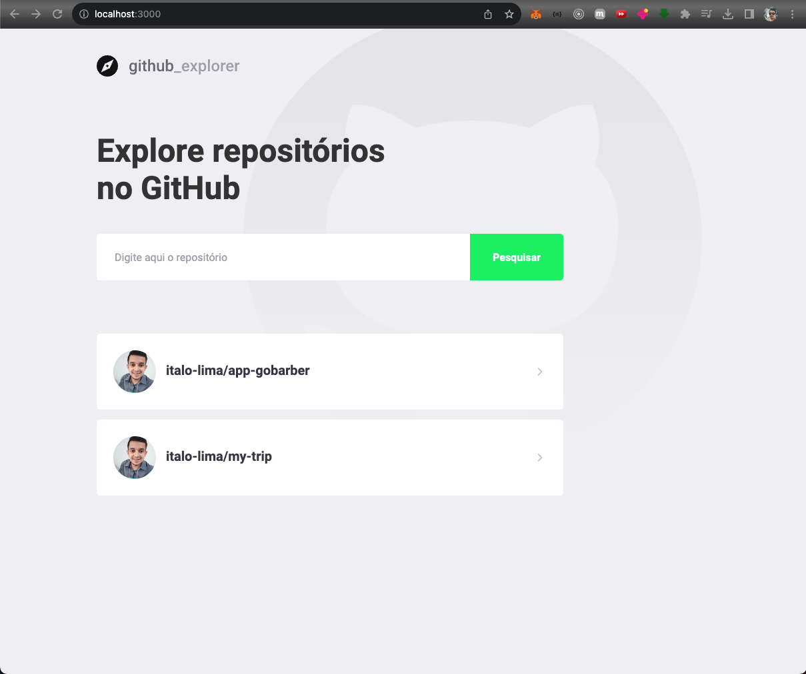

<h4 align="center">
  🚀 Github Explorer
</h4>

<p align="center">
  <a href="#-technology">Technology</a>&nbsp;&nbsp;&nbsp;|&nbsp;&nbsp;&nbsp;
  <a href="#-project">Project</a>&nbsp;&nbsp;&nbsp;|&nbsp;&nbsp;&nbsp;
  <a href="#-executing">Executing</a>&nbsp;&nbsp;&nbsp;
</p>

<p align="center">
  
</p>

## :rocket: Technology

:point_down: This project was developed with: :point_down:

-  [ReactJS](https://nodejs.org/en)
-  [Typescript](https://www.typescriptlang.org/)
-  [Styled Components](https://styled-components.com/)
-  [Local Storage](https://developer.mozilla.org/en-US/docs/Web/API/Window/localStorage)
-  [Github API](https://docs.github.com/)

## 🔖 Project

GitHub Explorer uses the GitHub API to find source code repositories and provides a comprehensive view of the issues, stars, and forks associated with each repository. With an intuitive interface, users can explore projects, review open issues and dive into different branches, facilitating collaboration and management of development projects

## 💻 Executing

```bash
# Clone this project
$ git clone git@github.com:italo-lima/github-explorer.git
# Join folder
$ cd github-explorer
# Install dependencies
$ yarn
# Run application
$ yarn start
